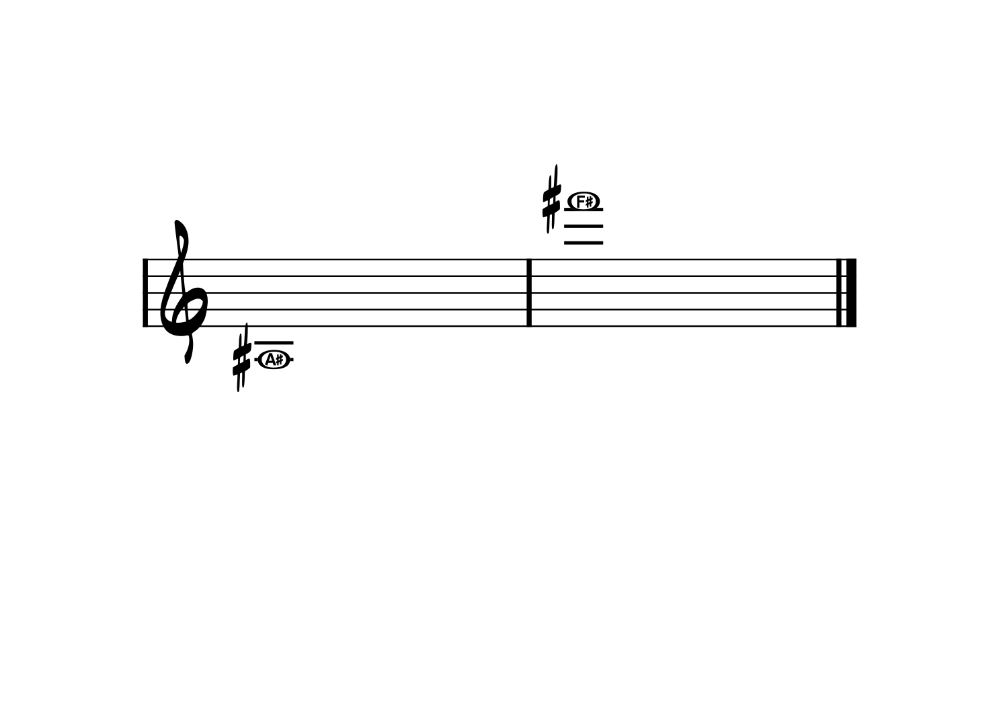

  Celem niniejszej Szkoły jest systematyczne opanowanie techniki gry na saksofonie. Zawarty tu materiał obejmuje najważniejsze zagadnienia techniczne przedstawione w formie uporządkowanych ćwiczeń, podzielonych na rozdziały odpowiadające kolejnym etapom kształcenia muzycznego.

  Ćwiczenia te należy traktować jako podstawę codziennej pracy. Powinny być one powtarzane regularnie, w zależności od indywidualnych potrzeb i zauważonych braków technicznych. Zaleca się wykonywanie ich w różnych tonacjach oraz stosowanie zróżnicowanych wariantów rytmicznych, aby w pełni rozwijać precyzję, elastyczność i biegłość gry.

  Materiał zawarty w Szkole stanowi jedynie fundament dalszej edukacji. Powinien on być uzupełniany o repertuar przewidziany programem nauczania dla poszczególnych klas: etiudy doskonalące warsztat, utwory z towarzyszeniem fortepianu, koncerty, sonaty oraz dzieła kameralne. Dopiero połączenie materiału technicznego z regularną pracą nad repertuarem umożliwia wszechstronny rozwój muzyczny.

## Skala instrumentu

  Skala dźwięków saksofonu obejmuje dwie i dwie trzecie oktawy, mieszcząc się w przedziale od **Ais3/Bes3** do **Fis6/Gis6**, co stanowi typowy zakres instrumentu w praktyce edukacyjnej i koncertowej. Należy podkreślić, że możliwe jest granie dźwięków powyżej Fis6 dzięki technice **altissimo**, jednak w niniejszym materiale omawiany i prezentowany będzie wyłącznie podstawowy zakres skali.

##  Nazewnictwo dźwięków i tonacji

  W niniejszym materiale stosuję międzynarodowy system oznaczania dźwięków i tonacji, w którym **B** oznacza polski dźwięk **H**, tonacja **B-dur** odpowiada **B♭ Major**, a tonacja **H-dur — B Major**. Znajomość tego systemu jest kluczowa przy czytaniu międzynarodowych fake booków, transkrypcji jazzowych oraz w pracy z muzykami spoza Europy Środkowej. I w świecie saksofonu jazzowego jest to absolutny, niepodważalny standard.

## Ćwiczenia wstępne

  Ćwiczenia wstępne przygotowują do gry, kształcąc kontrolę oddechu, jakość dźwięku oraz podstawową koordynację palców. Stanowią solidny fundament dla wszystkich kolejnych ćwiczeń technicznych.
